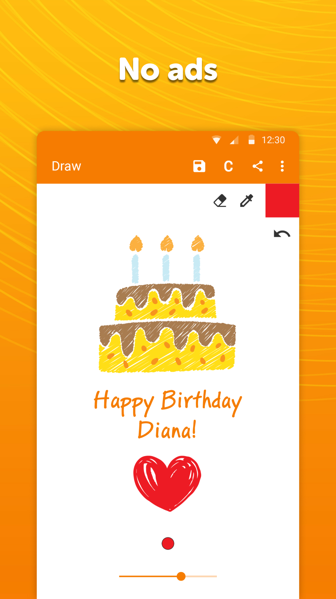
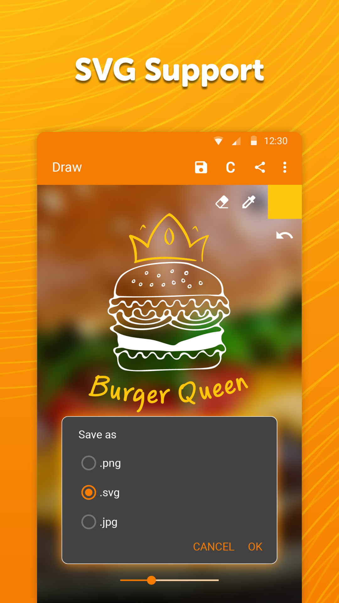
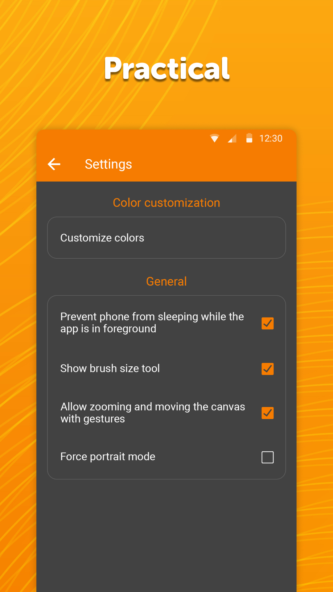

# Simple Draw

🎨 Are you looking for the best drawing app for your pocket? Do you want to draw something simple and easy, but you have no paper? You are in the right place!

Enjoy the moment with our specially designed drawing app, draw something fun and create your own artwork– all in a digital form!

Simple Draw is the best drawing app for anyone who loves to draw. Just pick paint and draw!

Paint and draw simple sketches for fun

With Simple Draw, you will not be needed any fancy or advanced tools or filters for your favourite doodle or sketch. Just use your creativity and freehand drawing to create the best sketches for your sketchbook. 

Try why we are the best drawing app where anyone can scribble something simple with fun!  

Simple Draw features 

This popular sketchbook for quick sketch and painting provides many useful functions:

✔️	Draw something colourful, simple sketch or doodle using a different paint and pen size  
✔️	Changing the background colour, or using an image from your sketchbook as the background  
✔️	Use an eraser if you took the wrong paint  
✔️	Insert paint either by selecting it on a palette, or by entering the colours hex code  
✔️	This simple sketchbook supports many different formats like PNG, JPG, or SVG vectors  
✔️	Share your paintings, draws & sketches with friends through email or social networks  
✔️	Simple Draw App works offline & online!

Use nothing else but your device and creativity to make some doodles and sketches!

Create your own sketchbook! 

No matter what age or abilities you have, the best drawing app offers a fun drawing experience! Draw a sketch, use your favourite paint and save your artwork in your own sketchbook. With Simple Draw, you can either draw new sketches from scratch or open some old artwork file from your sketchbook and just play around with new paints and colour.

Best drawing pad for your pocket! 

Our freehand drawing app allows you a digital way to draw a sketch or doodle, paint and explore the artist in you!

This specially designed drawing app and sketchbook go where your creativity takes you from quick sketch to funny artwork. So, open the drawing pad, paint and simply draw something nice! Have a quick draw on our drawing pad whether you are on a journey or in a move, enjoy the drawing experience, and share your draws and sketches with your friends.
 
Fun at home – learn sketching 

Our most popular drawing app is perfectly usable either for kids and beginners or for a family with children to play some drawing games and to learn sketching. After all, everyone has a piece of the artist in himself. 

Download our drawing app, draw your favourite art and share it on the social network with your friends.

Drawing for kids! 

Drawing for kids is important, and children are effective communicators, and through drawings, children learn to express their feelings and ideas freely. With our digital drawing pad, they can draw cars, flowers, dogs, cats, and other paintings and save them into the Gallery! 

Our best drawing app contains no ads or unnecessary permissions. With Simple Draw, you will create quick sketches or scribble something fun using just your creativity and imagination so just start drawing a doodle or sketch, and share your love and joy for creating simple art!

Check out the full suite of Simple Tools here:  
https://www.simplemobiletools.com

Facebook:  
https://www.facebook.com/simplemobiletools

Reddit:  
https://www.reddit.com/r/SimpleMobileTools

Telegram:  
https://t.me/SimpleMobileTools

