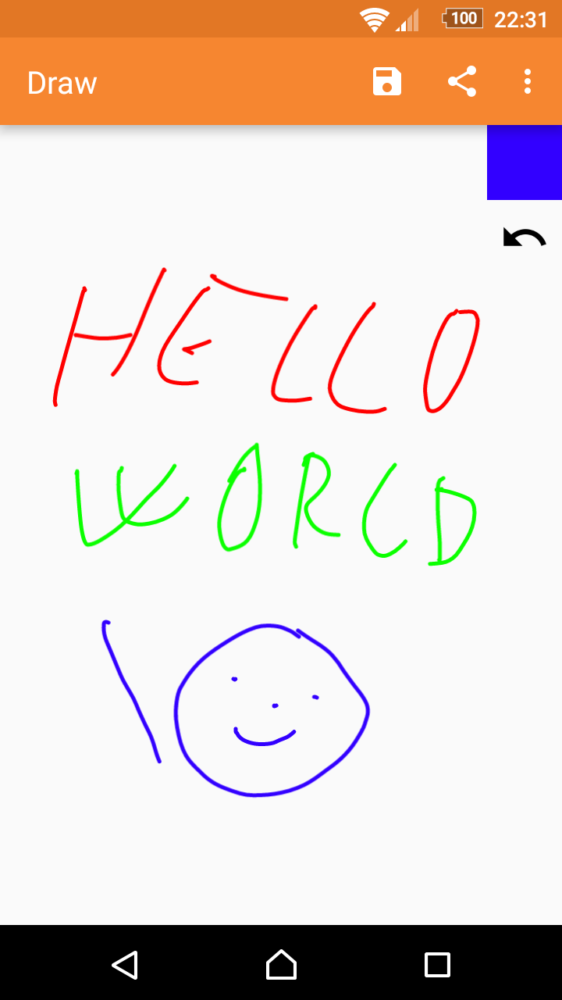

# Simple Draw

A canvas you can draw on with different colors.

Want to draw something but you have no paper? This app will suit you perfectly. Just pick a color and draw. You can either save the drawing or share it directly through email or social networks.

Contains no ads or unnecessary permissions. It is fully opensource, provides a Dark theme too.

This app is just one piece of a bigger series of apps. You can find the rest of them at http://www.simplemobiletools.com

License
-------
    Copyright 2016 SimpleMobileTools
    
    Licensed under the Apache License, Version 2.0 (the "License");
    you may not use this file except in compliance with the License.
    You may obtain a copy of the License at
    
       http://www.apache.org/licenses/LICENSE-2.0
    
    Unless required by applicable law or agreed to in writing, software
    distributed under the License is distributed on an "AS IS" BASIS,
    WITHOUT WARRANTIES OR CONDITIONS OF ANY KIND, either express or implied.
    See the License for the specific language governing permissions and
    limitations under the License.
