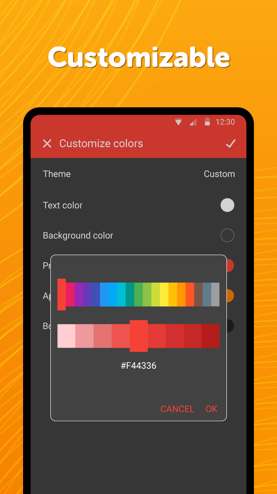

# Simple Draw

Want to draw something creative but you have no paper? This app will suit you perfectly. Just pick a color and draw, it is as easy as that. You can either save the drawing in a file, print it or share it directly through email or social networks so that your friends can have some fun with it too.

This hugely popular app for quick sketches provides many useful functions like Undo/Redo, changing the background color, or using an image as the background. You can optionally make the app prevent the device from falling asleep too. You can also change the brush size, or use an eraser, if you messed something up. It supports inserting colors either by selecting it on a huge palette, or by entering the colors hex code.

The app supports many different formats like PNG, JPG or SVG vectors.

You can either draw something new from scratch, or open some file and just play around with it. It is perfectly usable either by you, or by a family with children to play some games. After all, everyone has a piece of artist in himself.

You will not find any fancy or advanced tools, brushes, fonts, filters here, it is supposed to be used to have some fun with.

It comes with material design and dark theme by default, provides great user experience for easy usage. The lack of internet access gives you more privacy, security and stability than other apps.

Contains no ads or unnecessary permissions. It is fully opensource, provides customizable colors.

Check out the full suite of Simple Tools here:  
https://www.simplemobiletools.com

Facebook:  
https://www.facebook.com/simplemobiletools

Reddit:  
https://www.reddit.com/r/SimpleMobileTools

